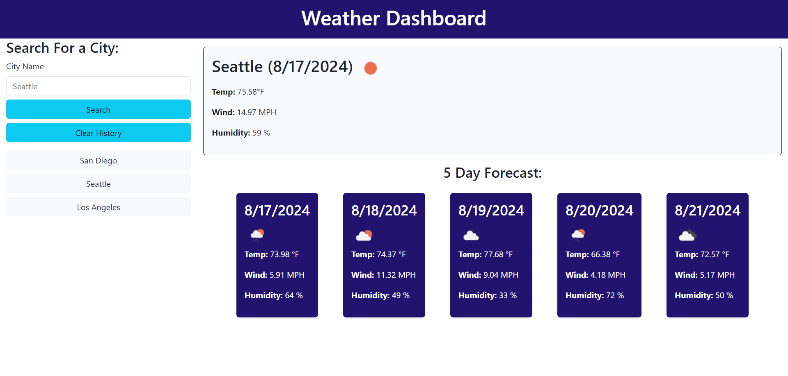

# Weather Dashboard

## Description
This web-based weather dashboard provides users with current weather conditions and a 5-day forecast for any city they choose. It features an intuitive interface that leverages Bootstrap for responsive design and styling.

## Table of Contents
* [Installation](#installation)
* [Usage](#usage)
* [License](#license)
* [Contributing](#contributing)
* [Credits](#credits)
* [Questions](#questions)

## Installation
N/A

## Usage
Upon visiting the application, the user will view the search bar in the upper left-hand corner. The user will simply enter the name of a city of their choice and click the "Search" button. This will display the dashboard with the current weather conditions and a 5-day forecast. This city will then appear in the search history on the left-hand column. To revisit any previously searched cities, the user may simply select a city to revisit the weather conditions. To clear the search history, the user may select "Clear History" just below the "Search" button. 

View this deployed application [here](https://hannahpsmith.github.io/weather-dashboard/)

## License
N/A

## Contributing
Please contact me regarding contributing to this application.

## Credits
Resources used: 

* [Bootstrap Library](https://getbootstrap.com/)

* [OpenWeather API](https://openweathermap.org/)

* [Day.js](https://day.js.org/en/)

## Questions
Please contact me with any questions.

Github: hannahpsmith (https://github.com/hannahpsmith)

Email: hannahpsmith94@gmail.com
